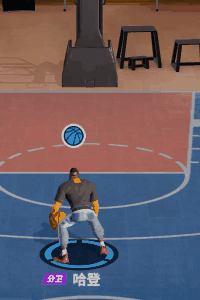
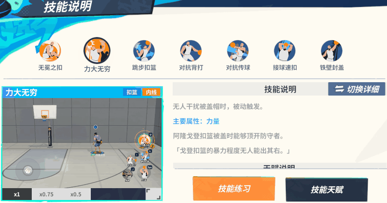

# 💼 ポートフォリオ

## 基本情報

- **氏名**：石　国豪
- **職種**：ゲームクライアントエンジニア
- **経験年数**：5年（NetEase Games）

---

## 参加プロジェクト一覧

### [Dunk City Dynast](https://www.dunkcitymobile.com/#/)

> NetEase Games (中国 网易) &ensp; 雷火部 &ensp; 2022.03～2024.07 &ensp; クライアントリード

- **プロジェクト概要**：NBA公式ライセンスを受けた3対3ストリートバスケットボール競技モバイルゲーム（ iOS / Android 対応 ）

- **使用技術**：Unity, C#, [xLua](https://github.com/Tencent/xLua), [behaviac](https://github.com/Tencent/behaviac), 状態同期

#### **担当業務**

&ensp;&ensp;<mark><b>1. キャラクタースキル</b></mark>

| 移動 | シュート | レイアップ | ダンク | ポストプレー | ピック＆ロール | ブロック | ドライブ |
| :---: | :---: | :---: | :---: | :---: | :---: | :---: | :---: |
|  |  |  |  |  |  |  |  |

選手のあらゆる行動はスキルとして実装されています。移動、シュート、レイアップ、ダンク、ポストプレー、ピック＆ロール、ブロック、ドライブなどの基本スキルのほか、これらを組み合わせた複合動作も含まれます。

- **アニメーションの予備演出**

プレイヤーがスムーズに選手を操作できるようにするために、各スキルの発動はサーバーからの許可を待たず、即座にスキルフローを開始します。
各スキルフローには一つ以上の重要なノード（キータイミング）があり、そのタイミングまでにサーバーからの応答が届かない場合、一時的にアニメーションをスローモーションで再生します。（例えば、0.1倍速）。

例としてシュートスキルの場合、「リリースポイント」が重要なノード（キータイミング）です。

プレイヤーがシュートボタンを押すと、クライアントはサーバーにリクエストを送信し、すぐにシュートアニメーションを再生します。通常の通信速度であれば、「ボールリリース（出手）」のタイミングまでに、クライアントはサーバーからの確認メッセージを受け取ります。もし確認メッセージが届かなかった場合、アニメーションをスロー再生して引き続き待機します。サーバーから「成功」の確認メッセージが届いた場合は、スキルの後続処理を実行します。「失敗」の確認メッセージが届いた場合は、ロールバックを行います。

&ensp;&ensp;<mark><b>2. AIロジック</b></mark>

AIは2種類に分けられます。ひとつはビヘイビアツリーAI、もうひとつは強化学習AIです。

- 2.1 **ビヘイビアツリーAI**

ビヘイビアツリーAIは[behaviac](https://github.com/Tencent/behaviac)を基盤として開発されており、パラメーターを調整することでAIの強さを簡単にコントロールできます。主にフレームワークの構築およびプランナー向けの各種APIの提供を担当しました。

ゲーム内には放置プレイのようなモードがあり、双方の選手はすべてAIによって操作されます。下の図をご覧ください。

- 2.2 **強化学習AI**

強化学習のトレーニングとデプロイは他の部署の担当者が行っており、私は主にゲームロジックのサポートを提供しています。

&ensp;&ensp;<mark><b>3. アニメーション編集ツール</b></mark>

「アニメーション編集ツール」は、Unity の IMGUI をベースに開発された、プランナーが選手のスキルアニメーションを編集するための社内向けツールです。選手のスキルは一つまたは複数のアニメーションによって構成されており、プランナーはこのツールを使って、スキルで使用されるアニメーションのほか、サウンド、ビジュアルエフェクト、カメラ演出、バフなど、編集・設定可能です。なお、本ツールは社内専用のため、一般向けのスクリーンショットは公開できません。

以下はサンプル画像です。

アニメーションは Unity の [Playable API](https://docs.unity3d.com/ja/2023.2/Manual/Playables.html) をベースに開発されており、自由にアニメーションを分割・組み合わせることができるようになっています。

&ensp;&ensp;<mark><b>4. その他</b></mark>

その他の補助的な機能

- 4.1 **トレーニング場**

トレーニング場はシングルプレイ用のゲームを開始するために使われます。
InGameサーバー用のコードがクライアントアプリ内に含まれており、起動時にクライアント上でローカルのInGameサーバーが立ち上がる仕組みです。

- 4.2 **スキルデモ**

上の図のスキルデモは動画を使用しているわけではなく、シングルプレイのゲームを起動し、AIが選手を操作して、RenderTextureで画面に表示しています。一連の最適化により、デモの起動時間は2秒以内に抑えられています。動画を使わないことでパッケージサイズを大幅に削減でき、スキルを修正した際も動画を再録する必要がありません。

- 4.3 **リプレイ・観戦**

サーバーは、ひとつの試合の基本情報や各選手の指令、サーバー側の指令などをすべてひとつのファイルに保存します。このファイルがリプレイファイルとなります。クライアントがリプレイを再生する際は、そのリプレイファイルを解析し、ローカルで試合を開始して、指令を時間順に実行していきます。

観戦の場合も同様で、サーバーがリアルタイムで指令を観戦者のクライアントに転送します。

---

### [トムとジェリー：チェイスチェイス （Tom and Jerry: Chase）](https://www.tomandjerrychaseasia.com/)

> NetEase Games (中国 网易) &ensp; 互娱部 &ensp; 2019.06～2022.03 &ensp; クライアントリード

- **プロジェクト概要**：人気アニメ「トムとジェリー」を題材とした、1対4の非対称型対戦アクションゲームです（ iOS / Android 対応 ）

- **使用技術**：Cocox2d-x, C/C++, Lua, [Box2d](https://github.com/erincatto/box2d), [Spine](https://esotericsoftware.com/), 決定論的物理を用いたフレーム同期

#### **担当業務**

&ensp;&ensp;<mark><b>1. キャラクタースキル・環境インタラクション</b></mark>

<table>
  <tr>
    <td></td>
    <td></td>
    <td></td>
    <td></td>
  </tr>
  <tr>
    <td></td>
    <td></td>
    <td></td>
    <td></td>
  </tr>
</table>

- フレーム同期では、ゲームの全ロジックはクライアントで処理され、サーバーは指令の中継のみを行う。

- 全てのクライアントは一定のフレームごとに、現在のゲーム状態からMD5のようなハッシュ値を計算し、それをサーバーに送信します。
これにより、同期のずれや不正行為の有無を判定できます

- すべてのロジック処理は決定論的に実行され、シングルスレッドかつ固定小数点演算を採用しています。また、Box2Dもクロスプラットフォームで結果が一致するように修正されています。

Ingameサーバーは指令を転送するだけなので、負荷は非常に低いです。そのため、128GBのメモリと64コアのサーバーの場合、最大で20万人程度を同時に処理できるようです。

&ensp;&ensp;<mark><b>2. 新人ガイド</b></mark>

ステートマシンを使って様々なステートを切り替える。

プランナーチームと各種インターフェースを取り決め、プランナーはJsonファイルを使ってステートマシンを設定する。

&ensp;&ensp;<mark><b>3. 周辺システム</b></mark>

主にUI開発です。

- 3.1 **限定イベント**

さまざまな期間限定イベントのテンプレートを開発し、企画担当がそのテンプレートに従ってイベントを設定する。

- 3.2 **ガチャシステム**

抽選プロセスを表示する。

